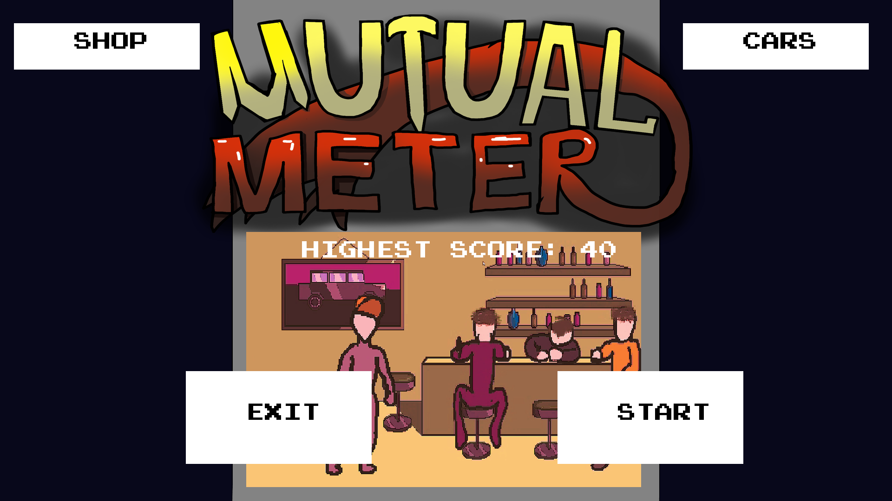
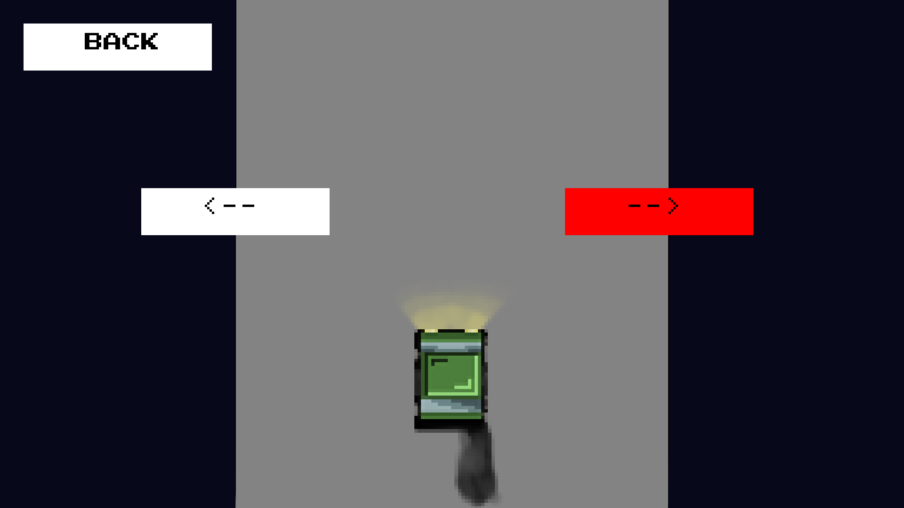
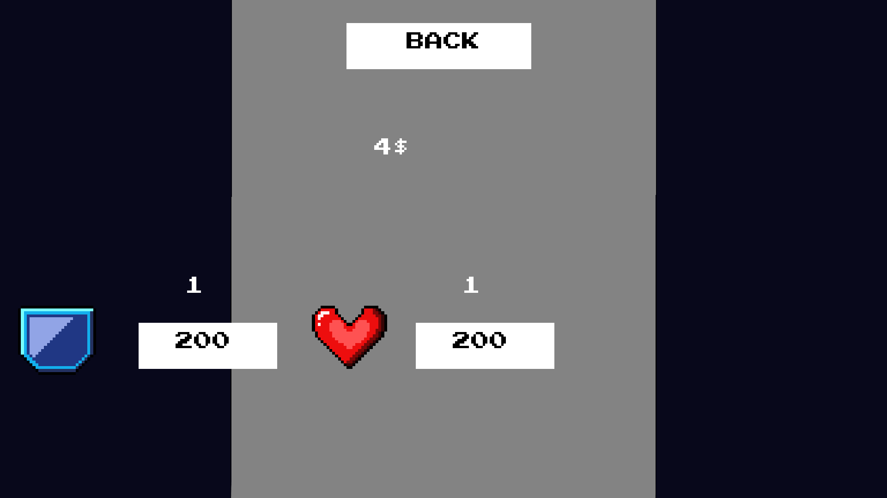

# Пояснительная записка для Mutual Meter
___
## Игровые классы
___
* ### Game
    ##### Класс служит для обработки всего что происходит в игре, он связывает через себя все остальные классы 
      Подгрузка ресурсов, инициализация данных для игры, работа с функцией drive и подключение других объектов
* ### Storage
    ##### Класс служит для чтания и записи данных пользователя
      Запись и чтение данных пользователей(scores.json), а также данных необходимых для запуска игры(prices.json)
* ### Display
    ##### Класс служит для отображения объектов на экране
      В различных классах определяется параметр display - объект класса Display для отображения элементов на экране
* ### Car
    ##### Класс служит для контроля действий игрока
      Объект класса Car хранит в себе все данные для работы машины(кол-во жизней, координаты)
* ### Clock
    ##### Класс служит для подсчета тиков игры
* ### Button
    ##### Класс описываает поведение кнопки
* ### MainMenu
    ##### Класс описывает поведение главного меню
      Объект этого класса отвечает за страничку MainMenu и содержит в себе все необходимые для отображения ф-ции
  
* ### ShopMenu
    ##### Класс описывает поведение экрана выбора скинов
      Объект этого класса отвечает за страничку ShopMenu(выбор скинов) и открывается при нажатии на кнопку Cars
  
* ### UpgradesMenu
    ##### Класс описывает экран выбора и покупки павер-апов
      Страничка покупки бустеров/павер-апов. Подгружает бонусы
  
* ### Road
    ##### Класс отвечает за поведение дороги
      Класс содержит в себе препятствия. Генерирует расположение препятствий на дороге
* ### Obstacles
    ##### Класс отвечает за поведение препятствий
      Хранит в себе препятствие, обновляет его скин и реанимирует самого себя
* ### Booster
    ##### Класс отвечает за поведение бустеров
      Отвечает за бонусы бустеров на дороге(добавялет жизни или на засчитывает столкновение)
* ### RoadLine
    ##### Класс отвечает за полосы на дороге
* ### VideoReader
    ##### Класс воспроизводит видео 